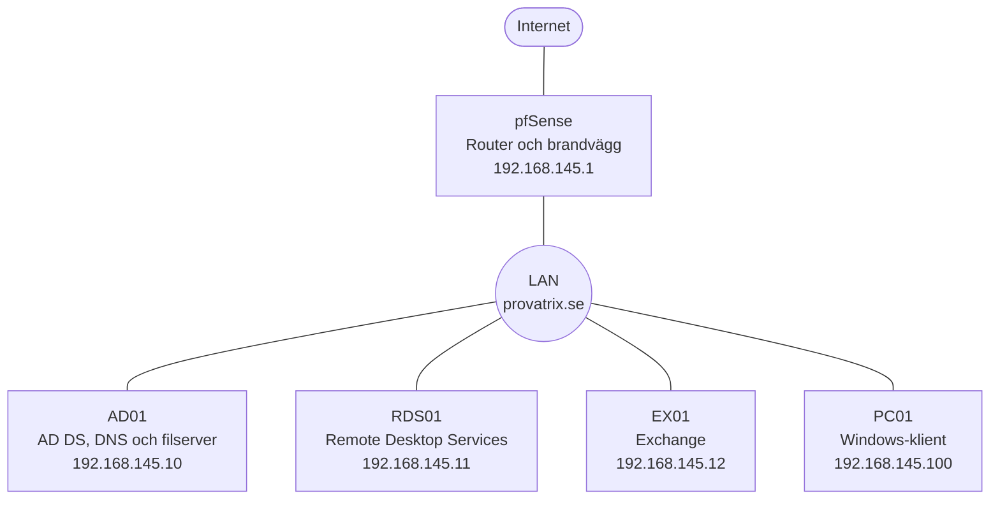
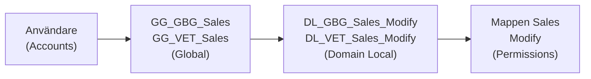

# Provatrix – Windows-infrastruktur för ett företag med två kontor

En komplett Windows-domänmiljö för ett fiktivt företag med kontor i Göteborg och Vetlanda. Miljön består av brandvägg, domänkontrollant med filserver, Exchange, Remote Desktop Services och en Windows-klient, och täcker allt från användare och behörigheter till e-post och fjärråtkomst till Office.

> Projekt inom utbildningen Moln- och virtualiseringsspecialist, Campus Mölndal.

**Teknik:** Windows Server 2019 · Active Directory · DNS · Group Policy · Storage Spaces · Exchange Server 2019 · Remote Desktop Services · Office 2013 · pfSense · PowerShell

---

## Miljö



| Server | Roll |
|---|---|
| pfSense | Router och brandvägg |
| AD01 | Domänkontrollant, DNS och filserver |
| RDS01 | Office som RemoteApp via webbläsaren |
| EX01 | E-post, kalender, delade postlådor och bokningsbara resurser |
| PC01 | Domänansluten klient med Office och Outlook |

### Programvara

| Programvara | Användning |
|---|---|
| Windows Server 2019 Standard (x64) | Operativsystem på AD01, RDS01 och EX01 |
| Microsoft Exchange Server 2019 | E-postserver på EX01 |
| Microsoft Office 2013 | Publicerat som RemoteApp på RDS01 och installerat på klienten |
| Microsoft .NET Framework 4.8 | Förutsättning för Exchange |
| Microsoft Visual C++ 2013 | Förutsättning för Exchange |
| Unified Communications Managed API (UCMA) | Förutsättning för Exchange |
| IIS URL Rewrite Module | Förutsättning för Exchange |
| Windows-roller och funktioner | Förutsättning för Exchange, installerade med PowerShell |

## Active Directory

- Ny skog och domän, **provatrix.se**, med AD DS och DNS på AD01
- Över 100 användare fördelade på två kontor och avdelningarna Ledning, Sälj, Marknad, IT, IT-support, Ekonomi, Lager och Vaktmästeri
- Behörigheter enligt **AGDLP**, med namnstandard per kontor och avdelning

### OU-struktur

```
provatrix.se
└── Provatrix
    ├── Users
    │   ├── Gothenburg
    │   └── Vetlanda
    ├── Groups
    │   ├── GG   (globala grupper, t.ex. GG_GBG_Sales)
    │   └── DL   (domänlokala grupper, t.ex. DL_GBG_Sales_Modify)
    ├── Servers
    └── Workstations
```

### AGDLP

Användare läggs aldrig direkt på en mapp. De läggs i en global grupp för sin avdelning, som i sin tur är medlem i en domänlokal grupp som har behörigheten. Exempel för säljavdelningen:



Det gör att en ny medarbetare får rätt åtkomst genom att läggas i en enda grupp.

## Filserver

- **RAID 1** med Storage Spaces: två virtuella diskar speglade till volymen `F:` (DATA)
- Delad mapp **Shared** med **Access-Based Enumeration**, så att användare bara ser mappar de har behörighet till
- Dold delad mapp **Redirected$** för Folder Redirection

```
F:\
├── Shared
│   ├── Public
│   ├── Sales
│   ├── Marknad
│   └── IT
└── Redirected
```

### NTFS-behörigheter

SYSTEM och Domain Admins har Full Control på alla mappar. Utöver det:

| Mapp | Behörighet |
|---|---|
| `Shared` | Domain Users: läsa och lista, så att alla kan öppna den delade mappen |
| `Shared\Public` | DL_GBG_Public_Modify och DL_VET_Public_Modify: Modify |
| `Shared\Sales` | DL_GBG_Sales_Modify och DL_VET_Sales_Modify: Modify |
| `Shared\Marknad` | DL_GBG_Marknad_Modify och DL_VET_Marknad_Modify: Modify |
| `Shared\IT` | DL_GBG_IT_Modify och DL_VET_IT_Modify: Modify |
| `Redirected` | CREATOR OWNER: Full Control på undermappar. Domain Users: får skapa sin egen mapp men inte läsa andras |

### Group Policy

| Policy | Inställning |
|---|---|
| Mappad enhet | `P:` pekar på den delade mappen Shared för alla användare |
| Folder Redirection | Användarnas Dokument sparas på filservern i stället för lokalt |

## Remote Desktop Services

- **RD Session Host** och **RD Web Access** på RDS01
- Office 2013 publicerat som **RemoteApp**: Word, Excel, PowerPoint, Outlook, Publisher och OneNote
- Användarna startar programmen via webbläsaren på `https://rds01.provatrix.se/RDWeb` och loggar in med sitt domänkonto
- Programmen körs på servern, så klienten behöver ingen egen Office-installation, och användaren får bara programmen, inte hela serverns skrivbord

**Åtkomststyrning:** bara medlemmar i gruppen **GG_RDS_Users** får ansluta. Gruppen ligger i den lokala gruppen Remote Desktop Users på RDS01, så att åtkomsten styrs centralt i AD.

**DNS och certifikat:** en DNS-post för `rds01.provatrix.se` och ett certifikat med samma namn bundet till IIS, så att RD Web fungerar utan certifikatvarningar.

## Exchange

### Installation
- Förutsättningarna installerades först: .NET Framework 4.8, Visual C++ 2013, UCMA, IIS URL Rewrite Module och nödvändiga Windows-funktioner. Se [`00-install-prerequisites.ps1`](scripts/exchange/00-install-prerequisites.ps1)
- AD förbereddes för Exchange med ett konto i Schema Admins, Enterprise Admins och Domain Admins. Se [`01-prepare-ad.ps1`](scripts/exchange/01-prepare-ad.ps1)
- Exchange installerades på en separat **RAID 1-disk**, inte på `C:`
- OWA och ECP verifierades efter installationen

### Postlådor
- Postlådor för alla användare skapade med ett skript som hoppar över dem som redan har en. Se [`02-enable-mailboxes.ps1`](scripts/exchange/02-enable-mailboxes.ps1)
- **Delade postlådor** för Sales, IT, Finance, Marknad, Lager och Service, med Full Access och Send As för respektive avdelning
- **Mötesrum** som kan bokas i Outlook, och **resurser** som lastbilar, skåpbil och utrustning. Se [`03-room-and-equipment-mailboxes.ps1`](scripts/exchange/03-room-and-equipment-mailboxes.ps1)

| Mötesrum | Kontor | Platser |
|---|---|---|
| Jamaica | Göteborg | 6 |
| Gran Canaria | Göteborg | 12 |
| Mykonos | Göteborg | 42 |
| Elba | Vetlanda | 4 |
| Haiti | Vetlanda | 18 |

- Behörigheter per avdelning via globala grupper. Se [`05-public-folder-permissions.ps1`](scripts/exchange/05-public-folder-permissions.ps1)

### E-postadresser och flera domäner
Företaget har ett dotterbolag med domänen **super.net**, som lades till som accepted domain. E-postadresspolicyer ger alla användare adresser automatiskt:

| Policy | Gäller | Adresser |
|---|---|---|
| EAP – Göteborg (prioritet 1) | Användare med Gothenburg i AD | Även förnamn@ och förnamn.efternamn@ på dotterbolagets domän |
| EAP – Default (prioritet 2) | Övriga användare | förnamn.efternamn@provatrix.se och förnamn.efternamn@super.net |

Se [`04-email-address-policies.ps1`](scripts/exchange/04-email-address-policies.ps1).

### Mailflöde
- **Send Connector** för utgående e-post till andra domäner
- Inkommande **SMTP på port 25** öppnad i brandväggen på EX01
- DNS på AD01: A-post för `mail.provatrix.se` och MX-post som pekar på den
- En extra DNS-zon för **super.net** simulerar en extern domän i labbet

**Verifiering**
- [x] `Test-Mailflow` som snabbkontroll av transport och leverans
- [x] E-post från provatrix.se till super.net levererades
- [x] E-post från super.net till provatrix.se hamnade i inkorgen i Outlook och OWA

### Autodiscover
Outlook hittar Exchange automatiskt via Autodiscover, med A-poster för `autodiscover.provatrix.se` och `mail.provatrix.se`. Se [`06-autodiscover-and-test.ps1`](scripts/exchange/06-autodiscover-and-test.ps1).

## Klient

- Windows-klient med AD01 som DNS-server
- Ansluten till domänen provatrix.se, inloggning med domänkonto
- Office 2013 installerat, och Outlook konfigurerar sig självt via Autodiscover

## Certifikat och åtkomst utanför nätverket

- **Intern certifikatutfärdare** med Active Directory Certificate Services på domänkontrollanten
- Certifikat för Exchange som täcker `mail.provatrix.se` och `autodiscover.provatrix.se`, bundet till IIS
- Rotcertifikatet importerat på klienten, så att Outlook inte visar certifikatvarningar
- **Outlook utanför nätverket:** port forwarding av HTTPS (443) i pfSense till EX01, extern DNS för mail och autodiscover, och externa URL:er i Exchange

## Felsökning

**Problem:** `iisreset` gick inte att köra i Exchange Management Shell.

**Orsak:** adminkontot som skapats för installationen var inte lokal administratör på EX01.

**Lösning:** kontot lades till i den lokala gruppen Administrators med PowerShell. Se [`fix-local-admin.ps1`](scripts/felsokning/fix-local-admin.ps1).

## Skript

| Fil | Syfte |
|---|---|
| [`exchange/00-install-prerequisites.ps1`](scripts/exchange/00-install-prerequisites.ps1) | Installerar Windows-funktionerna som Exchange kräver |
| [`exchange/01-prepare-ad.ps1`](scripts/exchange/01-prepare-ad.ps1) | Förbereder AD-schemat och domänen för Exchange |
| [`exchange/02-enable-mailboxes.ps1`](scripts/exchange/02-enable-mailboxes.ps1) | Skapar postlådor för alla användare i en OU |
| [`exchange/03-room-and-equipment-mailboxes.ps1`](scripts/exchange/03-room-and-equipment-mailboxes.ps1) | Skapar mötesrum och resurser |
| [`exchange/04-email-address-policies.ps1`](scripts/exchange/04-email-address-policies.ps1) | E-postadresspolicyer för båda domänerna |
| [`exchange/05-public-folder-permissions.ps1`](scripts/exchange/05-public-folder-permissions.ps1) | Behörigheter per avdelning |
| [`exchange/06-autodiscover-and-test.ps1`](scripts/exchange/06-autodiscover-and-test.ps1) | Autodiscover och test av mailflödet |
| [`felsokning/fix-local-admin.ps1`](scripts/felsokning/fix-local-admin.ps1) | Lösning på IIS-felet |

## Vad jag lärde mig


Projektet visade hur mycket i en Windows-miljö som bygger på Active Directory och DNS. Filservern, Exchange och RDS fungerar bara om kontona i AD och namnuppslagningen är rätt, och saknas en DNS-post, en öppen port eller ett certifikat slutar e-posten att fungera.

Jag lärde mig också värdet av en genomtänkt struktur. Med AGDLP och en tydlig namnstandard går det att hantera över 100 användare på två kontor, eftersom behörigheter styrs via grupper i stället för användare för användare.

Felsökningen av IIS-felet visade att felet inte alltid ligger där det syns. Felmeddelandet handlade om IIS, men orsaken var att kontot saknade lokal administratörsbehörighet. Det har lärt mig att kontrollera behörigheter tidigt när något oväntat inte går att köra.

Till sist såg jag nyttan med att planera ordningen innan man börjar: domänkontrollanten först, sedan filserver, Exchange och RDS, och sist klienten.
